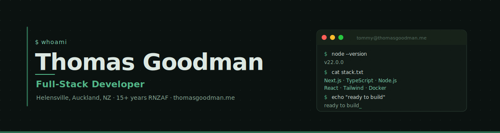

<div align="center">
  
</div>

<br>

<div align="center">

[](https://nextjs.org/)
[](https://www.typescriptlang.org/)
[](https://tailwindcss.com/)
[](https://react.dev/)
[](LICENSE)

[](https://github.com/tonkatommy/thomasgoodman.me/commits/main)
[](https://thomasgoodman.me)

<br>

**[🌐 Live Site](https://thomasgoodman.me)**
&nbsp;·&nbsp;
**[📄 View Resume](https://thomasgoodman.me/resume)**
&nbsp;·&nbsp;
**[✉️ Get in Touch](mailto:tommy@tommytinkers.nz)**
&nbsp;·&nbsp;
**[💼 LinkedIn](https://linkedin.com/in/tgnz)**

</div>

---

## What is this?

This is my personal corner of the internet. I'm Tommy Goodman, a full-stack developer based in Helensville, Auckland. Before I wrote a line of web code, I spent 15 years maintaining safety-critical avionics systems for the Royal New Zealand Air Force, which means I take reliability, documentation, and doing things properly very seriously.

This site is built to be the honest version of my professional presence. No inflated metrics, no buzzword soup, no "passionate ninja rockstar developer." Just the work, clearly presented.

---

## Tech Stack

<div align="center">

| Layer             | Technology                                        |
| ----------------- | ------------------------------------------------- |
| **Framework**     | Next.js 16 (App Router)                           |
| **Language**      | TypeScript 5                                      |
| **Styling**       | Tailwind CSS + CSS Custom Properties              |
| **UI Primitives** | Material UI (MUI)                                 |
| **Fonts**         | Exo 2 + Open Sans + JetBrains Mono (Google Fonts) |
| **Icons**         | Lucide React                                      |
| **CI/CD**         | GitHub Actions                                    |
| **Hosting**       | Vercel (planned)                                  |

</div>

---

## Features

- **Dark mode first** — light mode available via toggle, preference persisted in localStorage
- **Responsive** — built mobile-first, works everywhere
- **View Resume** — primary CTA, resume served as accessible PDF
- **Projects showcase** — featured work with live links and repo links
- **Tech stack grid** — grouped by proficiency level, no exaggeration
- **Blog** — MDX-powered posts, latest entry surfaced on the home page
- **Performance-first** — static generation where possible, dynamic where needed
- **No trackers, no ads** — just a website

---

## Site Sections

```
thomasgoodman.me/
  /               Hero → About → Projects → Stack → Why Me → Hobbies → Blog → Contact
  /projects       Full project archive
  /blog           All posts
  /blog/[slug]    Individual post
  /resume         Served resume (PDF)
```

---

## Project Structure

```
thomasgoodman.me/
├── .github/
│   ├── banner.svg              README hero image
│   └── workflows/
│       └── ci.yml              GitHub Actions CI
├── src/
│   ├── app/                    Next.js App Router
│   │   ├── layout.tsx          Root layout (fonts, theme, meta)
│   │   ├── page.tsx            Home page (all sections)
│   │   ├── blog/
│   │   │   ├── page.tsx        Blog index
│   │   │   └── [slug]/
│   │   │       └── page.tsx    Individual post
│   │   └── projects/
│   │       └── page.tsx        Projects archive
│   ├── components/
│   │   ├── ui/                 Design system primitives
│   │   │   ├── Button.tsx
│   │   │   ├── Card.tsx
│   │   │   ├── Tag.tsx
│   │   │   └── SectionHeader.tsx
│   │   ├── sections/           Home page sections
│   │   │   ├── Hero.tsx
│   │   │   ├── About.tsx
│   │   │   ├── Projects.tsx
│   │   │   ├── TechStack.tsx
│   │   │   ├── WhyMe.tsx
│   │   │   ├── Hobbies.tsx
│   │   │   ├── LatestPost.tsx
│   │   │   └── Contact.tsx
│   │   └── layout/
│   │       ├── Nav.tsx
│   │       ├── Footer.tsx
│   │       └── ThemeToggle.tsx
│   ├── styles/
│   │   ├── design-tokens.css   All CSS custom property tokens
│   │   └── globals.css         Base reset + global styles
│   ├── lib/                    Utilities and helpers
│   ├── content/                MDX blog posts + project data
│   └── types/                  TypeScript type definitions
├── public/
│   └── fonts/                  Local web fonts if needed
├── DESIGN_SYSTEM.md            Design system reference for Claude
├── tailwind.config.ts
├── tsconfig.json
├── next.config.ts
└── package.json
```

---

## Getting Started

### Prerequisites

- Node.js 22+
- npm 10+

### Installation

```bash
# Clone the repo
git clone https://github.com/tonkatommy/thomasgoodman.me.git
cd thomasgoodman.me

# Install dependencies
npm install

# Start the dev server
npm run dev
```

Open [http://localhost:3000](http://localhost:3000).

### Available Scripts

```bash
npm run dev        # Start dev server (http://localhost:3000)
npm run build      # Production build
npm run start      # Start production server
npm run lint       # ESLint check
npm run type-check # TypeScript check (no emit)
```

---

## Design System

The visual identity lives in two places:

| File                           | Purpose                                                                   |
| ------------------------------ | ------------------------------------------------------------------------- |
| `DESIGN_SYSTEM.md`             | Human and Claude-readable reference — tokens, components, patterns, rules |
| `src/styles/design-tokens.css` | The actual CSS custom properties implementation                           |
| `tailwind.config.ts`           | Tailwind theme extending with all tokens                                  |

Brand colours are earthy greens (`#52b788` on dark, `#2d6a4f` on light). Heading font is Exo 2, body is Open Sans, monospace accents use JetBrains Mono. The aesthetic sits between "terminal craftsman" and "warm professional" — never cold, never flashy.

---

## Related

- **[tommytinkers.nz](https://tommytinkers.nz)** — My freelance web and software dev brand
- **[github.com/tonkatommy](https://github.com/tonkatommy)** — All my public repos
- **[Sentinel](https://github.com/tonkatommy/Sentinel)** — Physical key management system (active project)

---

## Contact

Questions, opportunities, or just want to say hi:

- **Email:** [tommy@tommytinkers.nz](mailto:tommy@tommytinkers.nz)
- **LinkedIn:** [in/tgnz](https://linkedin.com/in/tgnz)
- **GitHub:** [tonkatommy](https://github.com/tonkatommy)
- **Location:** Helensville, Auckland, New Zealand

---

<div align="center">
  <sub>Built with care by Tommy Goodman. Dark mode is the default and that's not up for debate.</sub>
</div>
